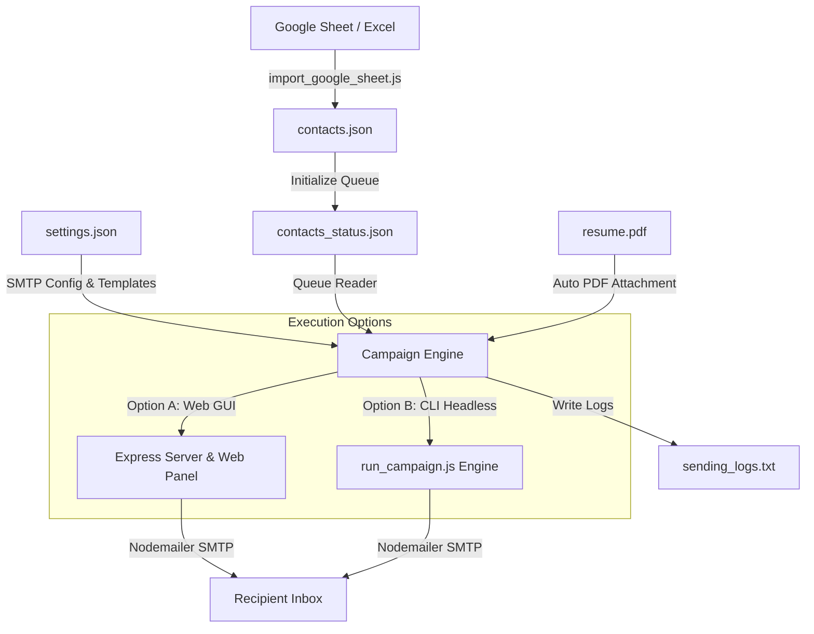

# 🚀 Cold Email Campaign Automation Engine & Contact Importer

An end-to-end, full-stack email outreach & campaign automation platform built with Node.js, Express, and Nodemailer. Designed for automated cold emailing, founder/recruiter outreach, and job application campaigns with strict deliverability guards, state persistence, real-time web monitoring, and Google Sheets integration.

---

## 📐 System Architecture



---

## ✨ Core Features

### 1. ⚡ Dual Execution Modes (Web GUI & Headless CLI)
* **Web Control Panel (`server.js` + `public/`)**: Full-featured Express backend serving a modern dark-themed web dashboard for visual monitoring, contact search, log streaming, settings editing, and campaign control.
* **Headless CLI Engine (`run_campaign.js`)**: Lightweight, standalone script designed for headless server or background terminal execution with zero UI dependencies.

### 2. 📊 Google Sheets Importer (`import_google_sheet.js`)
* **Direct Web CSV Fetch**: Fetches public/shared Google Sheets CSV/GViz endpoints directly over HTTP.
* **Smart Field Extraction**: Automatically cleans, formats, and extracts recruiter/founder **names**, **companies**, **titles**, and **email addresses**.
* **Greeting Personalization**: Extracts first names for natural email greetings.
* **Auto Backup**: Automatically archives existing campaign databases into `backups_pdf/` before overwriting.

### 3. 🎯 Template Engine & Placeholders
Templating engine supporting both double-brace (`{{var}}`) and single-brace (`{var}`) tags:
* `{{founder_name}}` / `{name}`: Target contact's first name.
* `{{company_name}}` / `{company}`: Target company name.
* `{title}`: Recruiter/founder job title.
* `{email}`: Target email address.
* Built-in helpers for custom URLs (portfolio, GitHub, case studies).

### 4. 🛡️ Deliverability & Safety Guardrails
* **Randomized Anti-Spam Delays**: Built-in jitter delay between emails (e.g. 45–90 seconds) to prevent triggering ISP rate-limiters and spam filters.
* **Daily Sending Caps**: Configurable maximum email limit per 24-hour cycle (`maxPerDay`, default 40) to protect sender domain reputation.
* **Crash-Resilient State Engine**: Saves real-time delivery state (`pending`, `sending`, `sent`, `failed`) in `contacts_status.json`. Automatically recovers gracefully from restarts or network interruptions.
* **Automated PDF Attachment**: Automatically locates and attaches your resume PDF (`resume.pdf` or `resume (10).pdf`) to outgoing messages.

### 5. 🖥️ Interactive Web Dashboard (`public/`)
* **Live Metrics**: Total contacts, sent, failed, pending, and skipped counts.
* **Queue Controls**: Start, pause, or reset campaign execution on the fly.
* **Real-time Terminal Logs**: Live event streaming directly inside the UI.
* **Contact Management**: Filter contacts by status (`pending`, `sent`, `failed`, `skipped`), search by name/company/email, and toggle individual skip states.
* **SMTP Configurator & Mail Tester**: Edit SMTP credentials, test connection, and send instant test emails to yourself.

---

## 📂 Project Structure

```bash
emailsender/
├── public/                     # Frontend dashboard assets
│   ├── index.html              # Single-page web dashboard interface
│   ├── style.css               # Modern glassmorphism dark-mode stylesheet
│   └── app.js                  # Dashboard state management & API layer
├── import_google_sheet.js      # Google Sheets importer & contact normalizer
├── run_campaign.js             # Standalone CLI campaign automation engine
├── server.js                   # Express server & API endpoints for web GUI
├── settings.json               # Persisted configuration (SMTP, templates, limits)
├── contacts.json               # Raw imported contacts list
├── contacts_status.json        # Campaign execution tracking database
├── sending_logs.txt            # Real-time event & error log file
├── resume (10).pdf             # Resume PDF attachment file
├── package.json                # Node.js project manifest and scripts
└── README.md                   # Complete system documentation
```

---

## 🛠️ Quick Start Guide

### 1. Prerequisites
Ensure you have **Node.js v16+** installed on your system.

### 2. Installation
Clone the repository and install dependencies:
```bash
git clone https://github.com/keshav9926/emailsender-automated.git
cd emailsender-automated
npm install
```

---

## 📥 Importing Contacts

### Import from Google Sheets
1. Ensure your Google Sheet is set to *"Anyone with the link can view"*.
2. Update the `SHEET_URL` variable inside `import_google_sheet.js` with your spreadsheet ID:
   ```javascript
   const SHEET_URL = 'https://docs.google.com/spreadsheets/d/YOUR_SPREADSHEET_ID/gviz/tq?tqx=out:csv';
   ```
3. Run the importer:
   ```bash
   node import_google_sheet.js
   ```
This generates `contacts.json` and initializes `contacts_status.json` with all entries marked as `pending`.

---

## 🚀 Running Campaigns

### Method 1: Web Dashboard (Recommended for UI control)
1. Start the server:
   ```bash
   npm start
   ```
2. Open **`http://localhost:3000`** in your browser.
3. Configure your SMTP settings in the **Settings** section:
   * **Host**: `smtp.gmail.com`
   * **Port**: `587` (or `465` for SSL)
   * **User / Email**: `your-email@gmail.com`
   * **Password**: Your SMTP App Password *(e.g., Google App Password)*
4. Set your subject line and email body using placeholders like `{{founder_name}}` and `{{company_name}}`.
5. Run **Send Test Email** to verify deliverability and attachment.
6. Click **Start Campaign**!

### Method 2: Headless CLI (Recommended for background / VPS runs)
Run the automated CLI engine directly from terminal:
```bash
node run_campaign.js
```
This reads `settings.json`, monitors `contacts_status.json`, sends emails sequentially with randomized delays, logs events to `sending_logs.txt`, and stops when completed or when daily caps are reached.

---

## ⚙️ Configuration File (`settings.json`)

```json
{
  "smtp": {
    "host": "smtp.gmail.com",
    "port": 587,
    "secure": false,
    "user": "your-email@gmail.com",
    "pass": "your-app-password",
    "senderName": "your name ",
    "senderEmail": "your-email@gmail.com"
  },
  "template": {
    "subject": "exploring opportunities at {{company_name}}",
    "body": "Hi {{founder_name}},\n\nQuick one — I'm Keshav..."
  },
  "delay": 30000,
  "randomizeDelay": true,
  "minDelay": 45000,
  "maxDelay": 90000,
  "maxPerDay": 40
}
```

---

## 🛡️ Inbox Deliverability Best Practices

To ensure cold emails land in the **Inbox** rather than Spam:
1. **Always Specify Specific Company Names**: Avoid generic text like *"at your company"* as spam filters flag unfilled variables.
2. **Set SPF, DKIM, & DMARC**: When using custom domains, ensure DNS security records are active.
3. **Pacing**: Keep `minDelay` at **45+ seconds** and daily limits strictly under **40 emails per mailbox per day**.
4. **Clean Contact Lists**: Verify email addresses to maintain bounce rates strictly below 2%.

---

## 📜 License
MIT License. Built by [Keshav Kakani](https://github.com/keshav9926).
