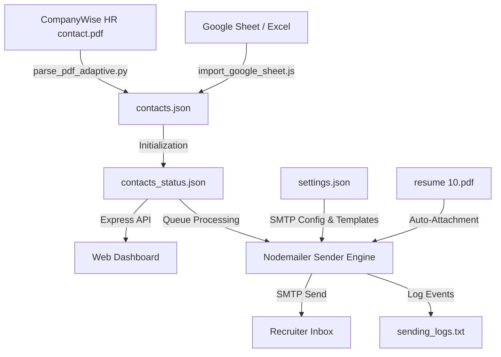

# Cold Email Campaign Automation Server & PDF/Excel Parser

An end-to-end, locally hosted email campaign management system. It parses unstructured recruiter/HR contact lists directly from PDFs and Google Sheets, cleans the data, configures SMTP nodes, designs customizable templates, tracks delivery progress, and enforces safety guards to automate outreach.

---

## 🚀 System Architecture Flow



---

## ✨ Features

### 1. 🤖 Adaptive PDF Layout Parser (`parse_pdf_adaptive.py`)
PDF column extractors often merge columns or misalign table cells when pages have varying layout shifts. This system features an **adaptive coordinate-based algorithm**:
* **Dynamic Column Alignment**: Analyzes the layout spacing of each page individually to locate name, email, title, and company details.
* **Median Coordinate Anchor**: Calculates median start offsets for columns per page to prevent outlier lines from corrupting the layout parsing.
* **Merged Line Reconstruction**: Reconstructs fields on complex rows where columns bleed into each other.
* **Validation**: Auto-flags and validates email strings to prevent bad delivery attempts.

### 2. 📊 Google Sheets / Excel Importer (`import_google_sheet.js`)
Integrates directly with online Google Sheets to import recruiter lists:
* **Automatic Mapping**: Maps spreadsheet columns (`First Name`, `Email`, `Title`, `Company`) to campaign variables.
* **Greeting Personalization**: Dynamically isolates the recruiter's **First Name** for warm, conversational greetings.
* **Validation Filter**: Automatically validates and filters out rows that lack valid email addresses.
* **Auto-Backup**: Automatically backs up older campaign database files to the `backups_pdf/` directory before overwriting.

### 3. 📊 Campaign Control Dashboard (`public/`)
A premium web panel to track, configure, and control the mailing queue:
* **Real-time Metrics**: Card-based displays showing total, sent, failed, pending, and skipped counts.
* **Interactive Control**: Toggle-states to **Start**, **Pause**, or **Reset** the email queue.
* **Live Feed Logs**: Active, real-time logging output from the backend sending loop.
* **Contact Table**: Paginated list of contacts featuring a live search bar and the ability to skip/unskip specific recruiters.
* **Live SMTP Tester**: Validate SMTP settings and send test emails containing the PDF attachment before starting a campaign.

### 4. 🛡️ Delivery Safety Guards (`server.js`)
To prevent SMTP account locks, spam classifications, and crashes:
* **Daily Send Limits**: Configurable daily sending threshold cap (default `450/day` to stay within Google free limits of 500). Automatically pauses sending when reached.
* **Sending Delays**: Configured interval delay between individual emails (default `10 seconds`) to avoid spam flags.
* **State Persistence**: Saves individual progress in `contacts_status.json`. If the server crashes or restarts, it picks up exactly where it left off, reverting any active `sending` status back to `pending`.
* **Auto-Attachment Detection**: Automatically detects and attaches `resume (10).pdf` in the workspace directory.

---

## 📂 Project Structure

```bash
emailsender/
├── public/                     # Frontend dashboard assets
│   ├── index.html              # HTML structure of the control panel
│   ├── style.css               # Styling and premium dark-mode interface
│   └── app.js                  # Frontend API requests and UI logic
├── parse_pdf_adaptive.py       # Python PDF layout parsing script
├── import_google_sheet.js      # Google Sheets contact importer script
├── server.js                   # Node.js Express server and nodemailer loop
├── settings.json               # Persisted user settings (SMTP details & templates)
├── contacts.json               # Parsed recruiters list
├── contacts_status.json        # Progress state of the mailing list
├── sending_logs.txt            # Real-time event log file
├── resume (10).pdf             # PDF attachment sent with the emails
├── package.json                # Project dependencies and script triggers
└── README.md                   # Project documentation
```

---

## 🛠️ Getting Started

### 1. Installation
Ensure you have [Node.js](https://nodejs.org/) and [Python](https://www.python.org/) installed.

**Clone & Install Node Dependencies:**
```bash
npm install
```

**Install Python PDF Parsing Libraries:**
```bash
pip install pypdf
```

---

### 2. Option A: Parse PDF Contact File
If you have a PDF file with recruiter details, verify its path in `parse_pdf_adaptive.py` (default: `CompanyWise HR contact (1) (1).pdf`), then execute:
```bash
python parse_pdf_adaptive.py
```
This generates `contacts.json`. When the Express server boots, it reads this file to initialize the tracking state database in `contacts_status.json`.

---

### 3. Option B: Import from Google Sheets / Excel
If you are using a Google Sheet containing your contact lists:
1. Configure your spreadsheet's GViz API link in the `SHEET_URL` variable inside `import_google_sheet.js`.
2. Run the importer script:
   ```bash
   node import_google_sheet.js
   ```
This will automatically back up your previous campaign files, import all valid rows from your spreadsheet, map the columns, and initialize `contacts_status.json` with all entries set to `pending`.

---

### 4. Run the Campaign Server
Run the local Express server:
```bash
npm start
```
By default, the server runs at **`http://localhost:3000`**.

---

### 5. Configuration
1. Open the dashboard in your browser.
2. In the **Settings** panel, configure your SMTP settings:
   * **Host**: `smtp.gmail.com` (if using Gmail)
   * **Port**: `587`
   * **Username**: Your email address
   * **Password**: Your SMTP App Password (e.g., Google App Password)
3. Write your email template. You can use dynamic placeholders:
   * `{name}`: Recruiter's name
   * `{company}`: Recruiter's company
   * `{title}`: Recruiter's job title
   * `{email}`: Recruiter's email address
4. Click **Save Settings**.
5. Put your resume PDF in the root folder under the name **`resume (10).pdf`**.
6. Use the **Test Connection** feature to send a sample email to yourself first.
7. Click **Start Campaign**!

---

## 📈 Campaign Execution Summary

* **Total Contacts**: 638 (Current campaign)
* **Status**: Loaded from Google Sheets, ready to run.
