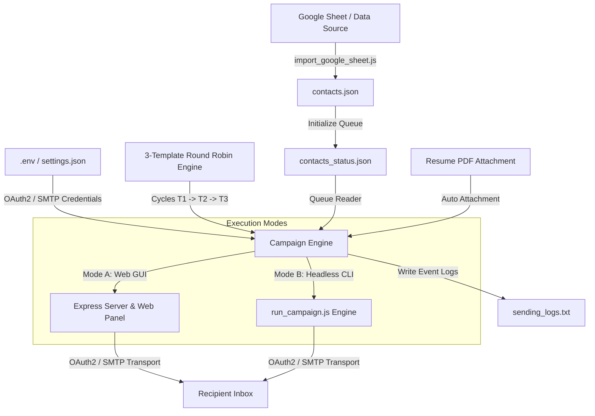

# 🚀 Cold Email Campaign Automation Engine & Outreach System

An end-to-end, high-performance email outreach and campaign automation platform built with Node.js, Express, and Nodemailer. Designed for high-deliverability founder outreach, job application campaigns, and cold emailing with strict deliverability guardrails, multi-template round-robin rotation, Google OAuth2 & SMTP authentication, state persistence, real-time web monitoring, and Google Sheets integration.

---

## 📐 System Architecture


```mermaid
graph TD
    A[Google Sheet / Data Source] -->|import_google_sheet.js| B[contacts.json]
    B -->|Initialize Queue| C[contacts_status.json]
    D[.env / settings.json] -->|OAuth2 / SMTP Credentials| E[Campaign Engine]
    F[3-Template Round Robin Engine] -->|Cycles T1 -> T2 -> T3| E
    C -->|Queue Reader| E
    G[Resume PDF Attachment] -->|Auto Attachment| E
    
    subgraph Execution Modes
        E -->|Mode A: Web GUI| H[Express Server & Web Panel]
        E -->|Mode B: Headless CLI| I[run_campaign.js Engine]
    end

    H -->|OAuth2 / SMTP Transport| J[Recipient Inbox]
    I -->|OAuth2 / SMTP Transport| J
    E -->|Write Event Logs| K[sending_logs.txt]
```

---

## ✨ Core Features

### 1. 🔑 Google OAuth2 & Institutional SMTP Support
- **Gmail OAuth2 Integration**: Authenticate securely using `client_id`, `client_secret`, and `refresh_token` to bypass app password restrictions and achieve optimal DKIM/SPF/DMARC deliverability.
- **Automatic Transport Detection**: Intelligently switches between Google OAuth2 and standard SMTP based on environment configurations.

### 2. 🔄 3-Template Round-Robin Rotation System
- **Anti-Fingerprinting Content Rotation**: Automatically cycles between 3 custom email templates (`T1 → T2 → T3 → T1...`) to prevent mailbox providers from flagging repetitive email text.
- **Dynamic Variable Compilation**: Compiles placeholders such as `{{founder_name}}` and `{{company_name}}` dynamically for every recipient.

### 3. ⚡ Dual Execution Modes (Web GUI & Headless CLI)
- **Web Control Panel (`server.js` + `public/`)**: Modern dark-themed dashboard with visual monitoring, recipient filter table, template previewer, and live event ledger.
- **Headless CLI Engine (`run_campaign.js`)**: Standalone, lightweight automation runner designed for continuous background terminal execution.

### 4. 🛡️ Institutional Deliverability & Safety Guardrails
- **Randomized 5-10 Minute Delays**: Enforces randomized delay intervals (300,000ms – 600,000ms) between sends to mimic organic human activity.
- **Strict Daily Volume Caps**: Hardcoded 35 emails/day cap to maintain sender domain reputation.
- **Crash-Resilient State Engine**: Persists real-time delivery status (`pending`, `sending`, `sent`, `failed`, `skipped`) in `contacts_status.json` with seamless process restart recovery.

### 5. 📥 Google Sheets Importer (`import_google_sheet.js`)
- Direct extraction from public/GViz Google Sheets endpoints.
- Cleans and normalizes founder/recruiter names, titles, companies, and emails.
- Automatic archive backup before dataset refresh.

---

## 📂 Project Structure

```bash
emailsender/
├── public/                     # Frontend web dashboard assets
│   ├── index.html              # Single-page web dashboard
│   ├── style.css               # Modern dark-mode styling
│   └── app.js                  # Frontend state management & API interaction
├── import_google_sheet.js      # Google Sheets contact import and normalizer
├── run_campaign.js             # Standalone CLI campaign execution engine
├── server.js                   # Express web server & API endpoints
├── get_refresh_token.js        # OAuth2 refresh token generator utility
├── .env.example                # Example environment variable template
├── package.json                # Node.js project manifest & dependencies
└── README.md                   # Complete system documentation
```

---

## 🛠️ Quick Start Guide

### 1. Prerequisites
- **Node.js v16+** installed on your machine.

### 2. Installation
```bash
git clone https://github.com/keshav9926/emailsender-automated.git
cd emailsender-automated
npm install
```

### 3. Environment Setup (`.env`)
Create a `.env` file in the root directory:
```env
PORT=3000
GMAIL_CLIENT_ID=your_oauth_client_id
GMAIL_CLIENT_SECRET=your_oauth_client_secret
GMAIL_REFRESH_TOKEN=your_oauth_refresh_token
GMAIL_USER=your_institutional_email@domain.com
```

---

## 🚀 Running Campaigns

### Option 1: Headless CLI Engine (Recommended for Background Execution)
Run the campaign engine in background CLI mode:
```bash
node run_campaign.js
```

### Option 2: Web Dashboard GUI
1. Start the web dashboard server:
   ```bash
   npm start
   ```
2. Open **`http://localhost:3000`** in your browser to monitor live stats, view real-time log activity, and manage contact statuses.

---

## 🛡️ Deliverability Best Practices

1. **OAuth2 Authentication**: Use Google OAuth2 for institutional Gmail accounts to satisfy strict SPF/DKIM validation.
2. **Pacing**: Maintain randomized delays of 5–10 minutes between outgoing emails.
3. **Volume Caps**: Keep daily sending volume under 35–40 emails per domain.
4. **Content Variance**: Utilize 3 alternating template variations to maintain high inbox placement scores.

---

## 📜 License
MIT License.
